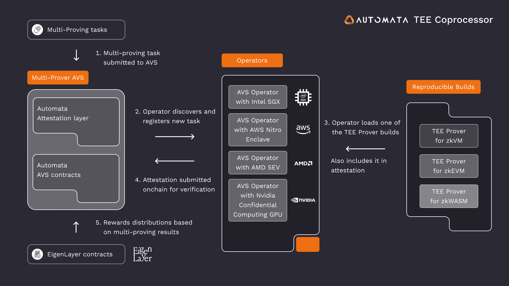

# Multi-Prover AVS Operator Setup
## About Multi-Prover AVS
Automata is building TEE Coprocessors on EigenLayer with Multi-Prover AVS. Decentralized systems bootstrap a secondary TEE Prover to minimize network-breaking bugs and achieve better security and decentralization. The approach is augmented by the introduction of TEE Committees. TEE AVSs are dually bounded by machine trust and cryptoeconomic security from Ethereum through EigenLayer. Refer to [Multi-Prover repository](https://github.com/automata-network/multi-prover-avs) to know more details.

## ChangeLog

| Releases | operator | prover | scroll-node | 
|----------|----------|--------|-------------|
| [v0.4.5 mainnet](mainnet/CHANGELOG.md)   | v0.4.0 | v0.4.5 | v5.7.0 |
| [v0.4.5 holesky](holesky/CHANGELOG.md) | v0.4.0 | v0.4.5 | v5.7.0 |
| [v0.4.0 mainnet](mainnet/CHANGELOG.md) | v0.4.0 | v0.4.0 | v5.6.0 |
| [v0.4.0 holesky](holesky/CHANGELOG.md) | v0.4.0 | v0.4.0 | v5.6.0 |
| [v0.3.0 holesky](holesky/CHANGELOG.md) | v0.3.0 | v0.3.0 | v5.5.0 |
| [v0.2.0 mainnet](mainnet/CHANGELOG.md) | v0.2.3 | v0.2.3 | v5.4.0 |
| [v0.2.0 holesky](holesky/CHANGELOG.md) | v0.2.3 | v0.2.3 | v5.4.0 |
| [v0.1.3 mainnet](mainnet/CHANGELOG.md) | v0.1.3 | v0.1.3 | v5.4.0 |

## Runbooks
* [Operator - Holesky testnet](holesky/README.md)
* [Operator - Ethereum mainnet](mainnet/README.md)
* [Moniroring](monitoring)
* [SGX Prover](prover)
